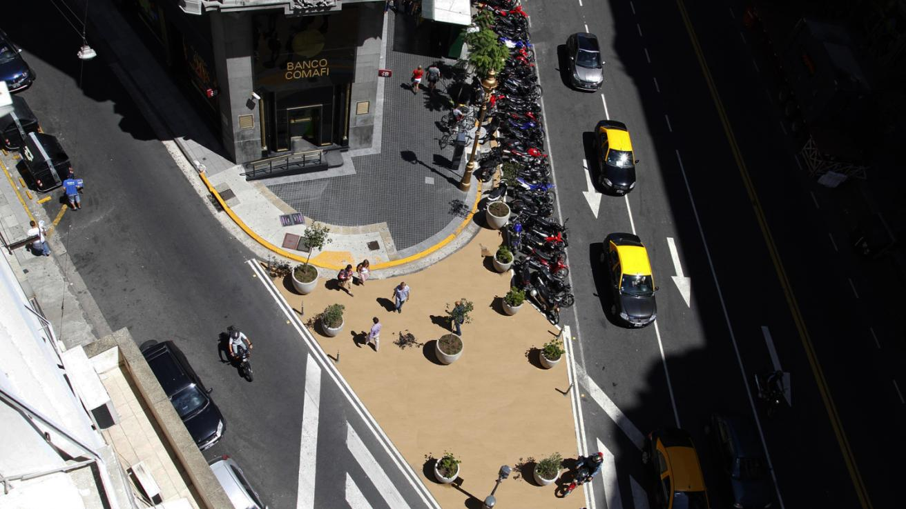
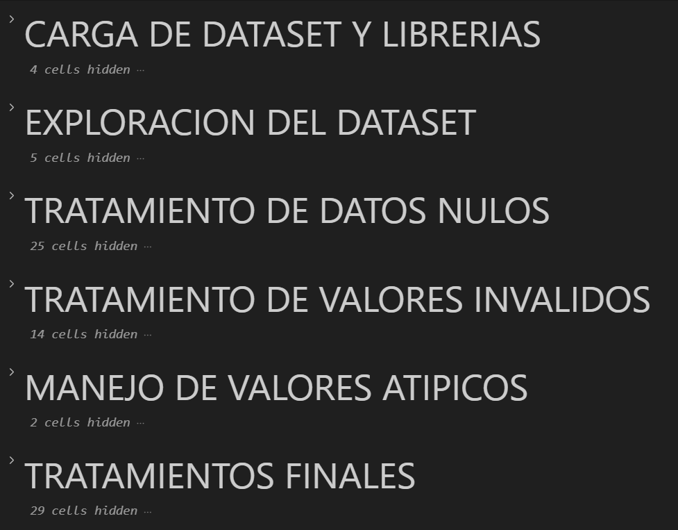
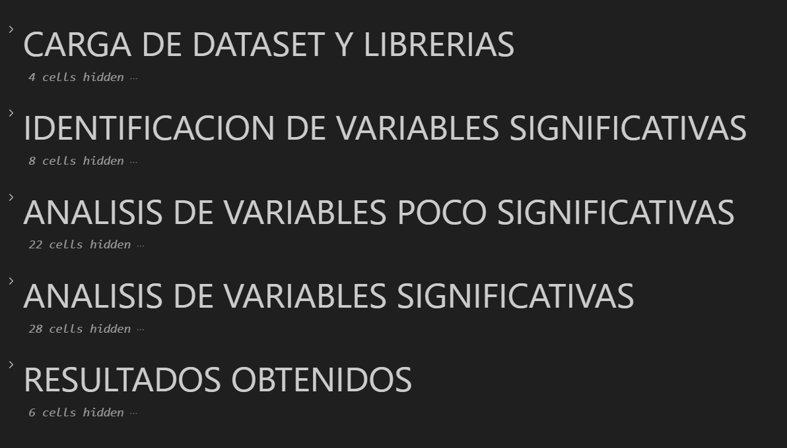
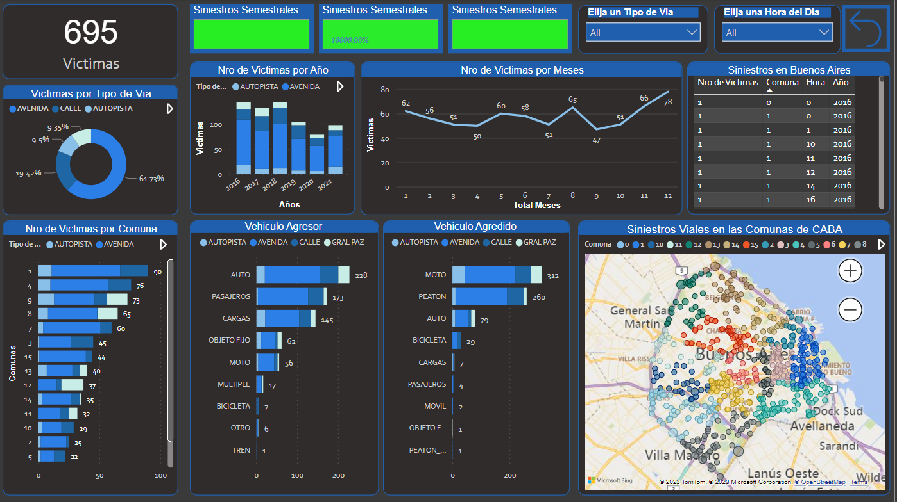

# <h1 align=center> **PROYECTO DE ANALISIS DE DATOS** </h1>

# <h1 align=center>**`Analítica de los Siniestros Viales en la Ciudad de Buenos Aires (2016-2021)`**</h1>

    

# <h1 align=center>**`Hoover Pedro Zavala`**</h1>
# <h3 align=center>**`Data Engineering | Data Science | BI & Data Analytics`**</h3>

 
 

 

## Tabla de Contenido

1. **[Introducción](#1-introduccion)**
2. **[Objetivo y Alcance](#2-objetivo-y-alcance-del-proyecto)**
3. **[Estructura del Repositorio](#3-estructura-del-repositorio)**
4. **[Tech Stack](#4-stack-tecnologico-utilizado)**
5. **[Flujo de Trabajo](#5-flujo-de-trabajo)**
6. **[Cierre](#6-gracias-por-su-atencion)**

 

## 1. Introducción 

De acuerdo con la OMS (2016), los accidentes de tránsito son la octava causa de muerte en el mundo.  
  
   

Por esta preocupación la Asamblea General de las ONU proclamó a nivel mundial el periodo 2011 – 2020 como el “Decenio de Acción para la Seguridad Vial”.  
A partir de esta iniciativa se propusieron 12 medidas en base a diversas investigaciónes y de experiencias del pasado que demostraron ser efectivas al atacar de manera sistémica el problema de la siniestralidad vial
En tre esas medidas se destacan: 

1.  Definir la naturaleza y costo de las muertes en vias publicas.
2.  Adquirir el compromiso y soporte de los encargados de tomar las decisiones.
3.  Establecer una política de seguridad vial a nivel nacional.
4.  Definir roles institucionales y responsabilidades.
5.  Identificar los problemas de seguridad vial.
6.  Establecer objetivos de seguridad vial.
7.  Formular una estrategia o un plan de acción.
8.  Asignar responsabilidades de las medidas a implantar.
9.  Asegurar la financiación de las medidas.
10. Aplicar medidas de efectividad conocida y documentada.
11. Monitorear el desempeño de las medidas.
12. Estimular la investigación y el desarrollo de capacidades.

Tomando varias o todas la medidas antes mencionadas, corresponde a la Secretaría de Transporte del Gobierno de la Ciudad Autónoma de Buenos Aires delinear un plan sistemico que tome cuerpo en un Sistema de Gestión de la Seguridad Vial para la  ciudad.

[arriba](#tabla-de-contenido) 

 

## 2. Objetivo y Alcance del Proyecto

En cuanto al trabajo que nos concierne, el Observatorio de Movilidad y Seguridad Vial (OMSV),  centro de estudios que depende de dicha secretaria, nos encomendó la elaboración de un proyecto de análisis de datos para los siniestros viales en la Ciudad de Buenos Aires.  

Para ello, nos disponibilizan un dataset sobre homicidios en siniestros viales acaecidos en la Ciudad de Buenos Aires durante el periodo 2016-2021.  

Entonces nuestro objetivo es el de, a partir de dicha fuente de datos, y aplicando técnicas de preparacion, análisis y visualización interactiva de datos, generar y brindar a la OMSV de informacion significativa junto con las recomendaciones para cada caso, para ser usada como `una herramienta adicional de apoyo en la toma de decisiones` de las autoridades locales encargadas de adoptar las medidas necesarias para disminuir la cantidad de víctimas fatales en siniestros viales.

[arriba](#tabla-de-contenido) 

 

## 3. **Estructura del Repositorio**

 

  
        

 

El repositorio contiene los siguientes elementos:  

**`Carpeta 'notebooks'.-`** contiene los notebooks que implementan el flujo de trabajo:  
* **`'data_preparation.ipynb'`**: implementación de la preparacion de los datos crudos.
* **`'EDA.ipynb'`**: implementación del analisis exploratorio de datos.

**`Carpeta 'entregables'`**: contiene los productos finales para el uso del cliente.
* **`'dashboard.pbix'`**: reporte interactivo con los KPIs formulados mas otras metricas y graficos relacionados
* **`'reporte.pdf'`**: reporte con los hallazgos del trabajo

**`Carpeta 'data'`**: contiene el dataset crudo mas los dataframes creados a apartir de las implementaciones ya mencionadas.

**`Archivo 'ReadMe.md`**: el archivo actual.

**`'Carpeta src'`**: carpeta fuente del archivo actual.

[arriba](#tabla-de-contenido) 

 

## 4. Stack Tecnologico Utilizado  
 
     
     
     
     
   

## 5. **Flujo de Trabajo**

Para completar el proyecto se dividio el trabajo en tres etapas sucesivas: 

### 1. Data Preparation
En esta primera etapa se preparó el dataset crudo de tal forma que en la etapa posterior pueda ser analizado sin inconvenientes. Para esto se aplicaron tareas de data cleaning como aplicar filtros, eliminar duplicados, corregir errores. Luego de la limpieza de datos se realizaron tareas básicas de data transformation para convertir el dataset a un formato fácilmente analizable. Dichas tareas incluyeron la normalizacion de tipos de datos y la eliminacion de campos innecesarios. 
Esta etapa se implementó en el notebook [1_data_preparation.ipynb](etapas/1_data_preparation.ipynb).  
A continuacion se muestra la organizacion general de las tareas: 

  
        

### 2. Análisis Exploratorio de Datos (EDA)
Con la data debidamente preparada, se realizó un análisis sobre todas las variables significativas para encontrar tendencias y patrones relevantes. A partir de estos insights se extrajeron la conclusiones y recomendaciones pertinentes. 
Se confeccionó un informe escrito sobre los resultados obtenidos, tanto en formato pdf como md.  
Esta etapa se implementó en el notebook [2_EDA.ipynb](etapas/2_EDA.ipynb).

A continuacion se muestra la organizacion general de las tareas:

  
    

### 3. Elaboracion de los Entregables para el Cliente
En base a los resultados obtenidos en el analisis exploratorio de datos se elaboro un reporte interactivo con los siguientes indicadores claves de desempeño:

KPI 1: Reducción en un 10% la tasa de victimas fatales en siniestros viales en CABA, respecto del semestre anterior.
KPI 2: Reducción en un 7% la cantidad de accidentes mortales de motociclistas en CABA en el último año, respecto al año anterior.
KPI 3: Reducción en un 5% la tasa de victimas fatales de peatones en accidentes viales en CABA, respecto al año anterior.  

A continuacon se muestra un screenshot del dashboard elaborado:

  
    

  
Además del dashboard, se elaboro un informe escrito en formato PDF sobre los hallazgos del trabajo, que comprende los insights encontrados, las conclusiones sacadas a partir de dichos insights y las recomendaciones y sugerencias.
Este informe tiene una version en formato MD para agilizar su lectura.

[arriba](#tabla-de-contenido) 

Definimos a la tasa de homicidios en siniestros viales como el número de víctimas fatales en accidentes de tránsito por cada 100,000 habitantes en un área geográfica durante un período de tiempo específico. Su fórmula es: (Número de homicidios en siniestros viales / Población total) * 100,000

Definimos a la cantidad de accidentes mortales de motociclistas en siniestros viales como el número absoluto de accidentes fatales en los que estuvieron involucradas víctimas que viajaban en moto en un determinado periodo temporal. Su fórmula para medir la evolución de los accidentes mortales con víctimas en moto es: (Número de accidentes mortales con víctimas en moto en el año anterior - Número de accidentes mortales con víctimas en moto en el año actual) / (Número de accidentes mortales con víctimas en moto en el año anterior) * 100

KPI 3: Reduc
El tercer KPI tenía como objetivo reducir un 10% la tasa de víctimas fatales en accidentes de tránsito de peatones respecto al año anterior. Si tomamos el último año del análisis comprobamos que NO se cumplió, ya que la tasa AUMENTÓ en un 2.9%. Similar a lo explicado anteriormente, la abrupta baja en la tasa del 2020 explica que el 2021 no sea un año con baja en la tasa de víctimas fatales. Sin embargo, un análisis global nos indica que efectivamente la tasa sumada año tras año ofrece una baja total del 17%

 

## 6. Gracias por su atención
Te parecio interesante el proyecto? No olvides [regalarme](https://github.com/pseeker33/Data_Analytics_Siniestros_Viales_en_Ciudad_de_Buenos_Aires/stargazers) una ⭐.  
Tienes una idea en mente o encontraste algun bug? Por favor abre un [issue](https://github.com/pseeker33/Data_Analytics_Siniestros_Viales_en_Ciudad_de_Buenos_Aires/issues) o inicia una [discusion](https://github.com/pseeker33/Data_Analytics_Siniestros_Viales_en_Ciudad_de_Buenos_Aires/discussions).  

**Usa mis redes para contactarme:**  

  

[arriba](#tabla-de-contenido) 