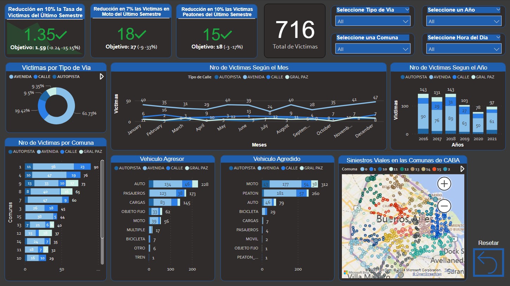

# <h1 align=center> **DATA ANALYSIS PROJECT** </h1>

# <h1 align=center>**`Road Accident Analytics in Buenos Aires City (2016-2021)`**</h1>

    

# <h1 align=center>**`Hoover Pedro Zavala`**</h1>
# <h3 align=center>**`Data Engineering | Data Science | BI & Data Analytics`**</h3>

 

Read this in [Spanish](README-es.md) / Lea este archivo en [español](README-es.md)  
Or check out the insights and final recomendations in [here](deliverables/findings-report.md)

 

## Table of Contents

1. **[Introduction](#1-introduction)**
2. **[Objective and Scope](#2-objective-and-scope)**
3. **[Repository Structure](#3-repository-structure)**
4. **[Tech Stack](#4-tech-stack)**
5. **[Workflow](#5-workflow)**
6. **[Closing Notes](#6-thank-you-for-your-attention)**

 

## 1. Introduction

According to the WHO (2016), road accidents are the eighth leading cause of death worldwide.

  
 

In response to this concern, the UN General Assembly declared 2011–2020 as the "Decade of Action for Road Safety."  
As part of this initiative, 12 measures were proposed based on research and past experiences proven effective in addressing road safety issues systematically. These include:

1. Defining the nature and cost of public road fatalities.
2. Securing commitment and support from decision-makers.
3. Establishing a national road safety policy.
4. Defining institutional roles and responsibilities.
5. Identifying road safety problems.
6. Setting road safety objectives.
7. Developing a strategy or action plan.
8. Assigning responsibility for the measures to be implemented.
9. Ensuring funding for the measures.
10. Implementing measures with known and documented effectiveness.
11. Monitoring the performance of the measures.
12. Encouraging research and capacity building.

With these or similar measures, it falls upon Buenos Aires City’s Department of Transportation to design a systemic plan implemented through a Road Safety Management System.

[back to top](#table-of-contents)

 

## 2. Objective and Scope

The Mobility and Road Safety Observatory (OMSV), a research center under the Buenos Aires City Department of Transportation, commissioned a data analysis project focused on road accidents in the city.

They provided a dataset containing data on road fatalities in Buenos Aires during 2016–2021.  
The goal is to apply data preparation, analysis, and interactive visualization techniques to generate meaningful insights and recommendations for OMSV. This work serves as an additional decision-support tool for local authorities to take the necessary measures to reduce road accident fatalities.

[back to top](#table-of-contents)

 

## 3. Repository Structure

 

    

The repository contains the following elements:

- **`'notebooks' folder`**: Contains notebooks implementing the workflow:
  - **`'data_preparation.ipynb'`**: Data cleaning and preparation.
  - **`'EDA.ipynb'`**: Exploratory Data Analysis (EDA).

- **`'deliverables' folder`**: Contains final client-ready products:
  - **`'dashboard.pbix'`**: Interactive report with KPIs and related metrics and charts.
  - **`'report.pdf'`**: Written findings report.
  - **`'report.md'`**: Web-readable version of the findings report.

- **`'data' folder`**: Contains raw dataset and cleaned dataframes.

- **`ReadMe.md` file**: This document.

- **`'src' folder`**: Source assets for this file.

[back to top](#table-of-contents)

 

## 4. Tech Stack

  
  
  
  

## 5. Workflow

The project workflow was divided into three key stages:

### 1. Data Preparation
This stage involved cleaning and transforming the raw dataset for analysis. Tasks included filtering, removing duplicates, fixing errors, normalizing data types, and removing unnecessary fields. Implemented in [1_data_preparation.ipynb](etapas/1_data_preparation.ipynb).  
Workflow overview:

    

### 2. Exploratory Data Analysis (EDA)
Analyzed key variables to uncover trends and patterns. Extracted insights for conclusions and recommendations. Implemented in [2_EDA.ipynb](etapas/2_EDA.ipynb).  
Workflow overview:

    

### 3. Deliverables for the Client

**Interactive Dashboard with KPIs**  
Created a report with KPIs including:

- KPI 1: 10% reduction in road fatalities in Buenos Aires compared to the previous semester.  
- KPI 2: 7% reduction in motorcyclist fatalities in the last year compared to the previous year.  
- KPI 3: 10% reduction in pedestrian fatalities compared to the previous year.  

    

**Findings Report**  
Alongside the dashboard, a PDF report was created summarizing insights, conclusions, and recommendations. A web-readable version is available as [report.md](deliverables/report.md).

[back to top](#table-of-contents)

 

## 6. Thank You for Your Attention
Did you find this project interesting? Don't forget to [give it a ⭐](https://github.com/pseeker33/Data_Analytics_Siniestros_Viales_en_Ciudad_de_Buenos_Aires/stargazers).  
Have an idea or found a bug? Please open an [issue](https://github.com/pseeker33/Data_Analytics_Siniestros_Viales_en_Ciudad_de_Buenos_Aires/issues) or start a [discussion](https://github.com/pseeker33/Data_Analytics_Siniestros_Viales_en_Ciudad_de_Buenos_Aires/discussions).  

**Feel free to contact me through my networks:**  
  
  

[back to top](#table-of-contents)
